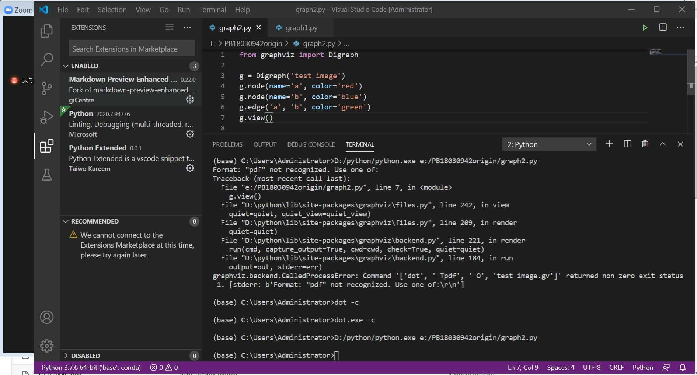

#  graphviz安装使用问题
[参考教程：十分钟学会graphviz画图](https://www.jianshu.com/p/6d9bbbbf38b1) 

## 问题

1：不知道什么是系统路径，怎么把安装目录的graphviz\bin加入环境变量PATH里
2：运行文件时（输入dot -Tpng first.dot -o first.png），显示Format: "pdf" not recognized。  
 

### 解决过程
1.环境变量配置：[参考教程](https://jingyan.baidu.com/article/67508eb404634f9cca1ce4ea.html)  
桌面计算机右键“属性”→高级系统设置→环境变量→系统变量Path后分号加入graphviz\bin文件完整路径名。之后应该不用重启电脑，重新打开终端(如VSCode)即可。
原因：其实安装是可以设置加入path，不过杀毒软件360安全卫士弹出窗口阻止，这是要点击允许。   
2.解决方法：  
链接：https://gitlab.com/graphviz/graphviz/-/issues/1315，问题与解决如下图：    
  
即终端输入dot.exe -c，之后就正常了。（至少我是这样的，原因暂时不明）。  
