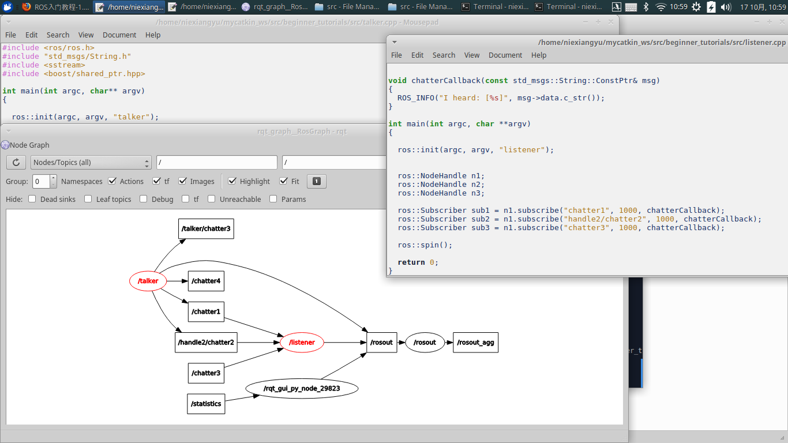
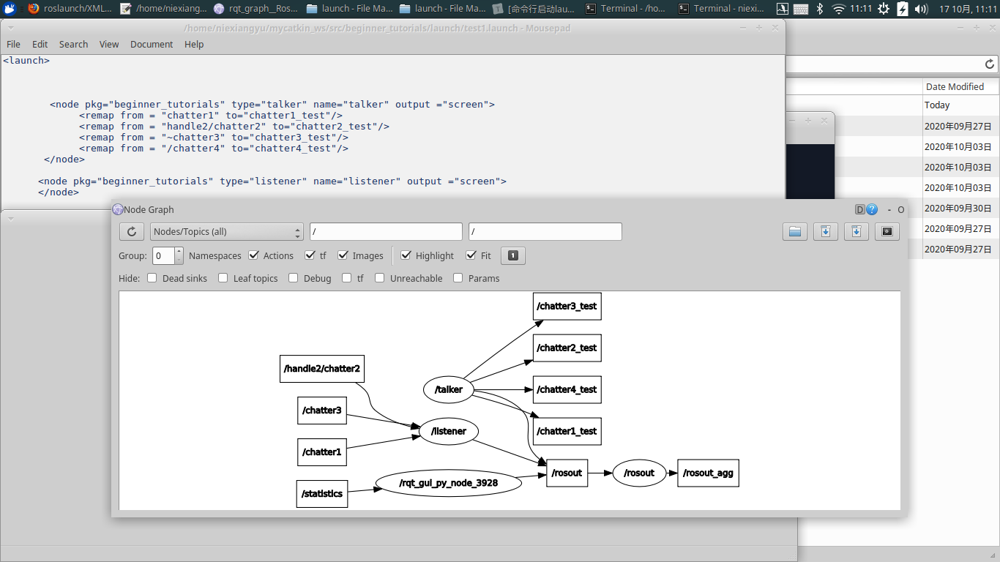
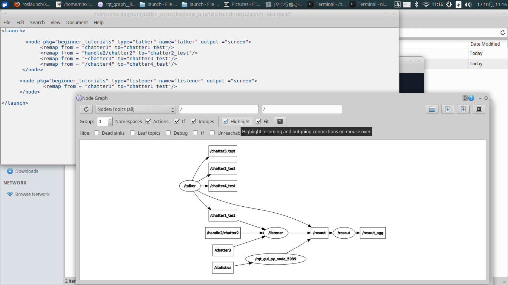
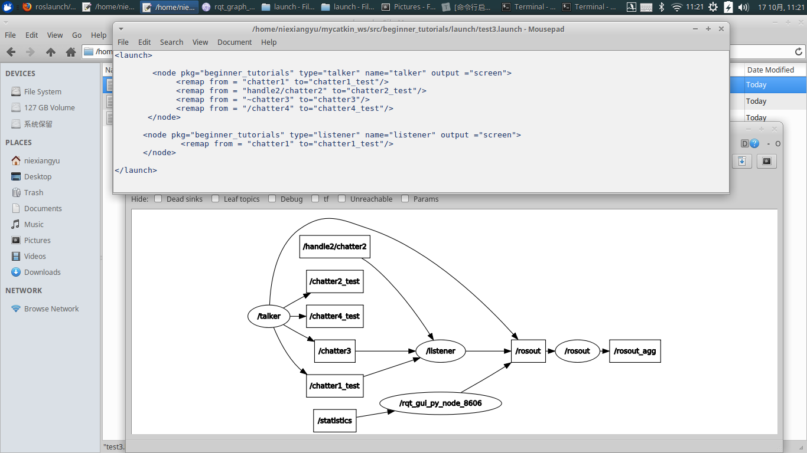
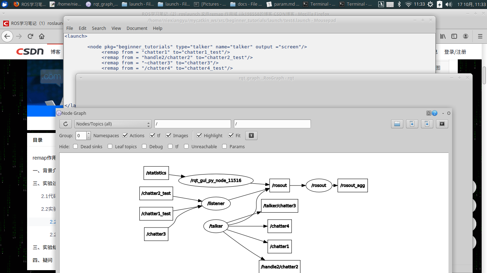
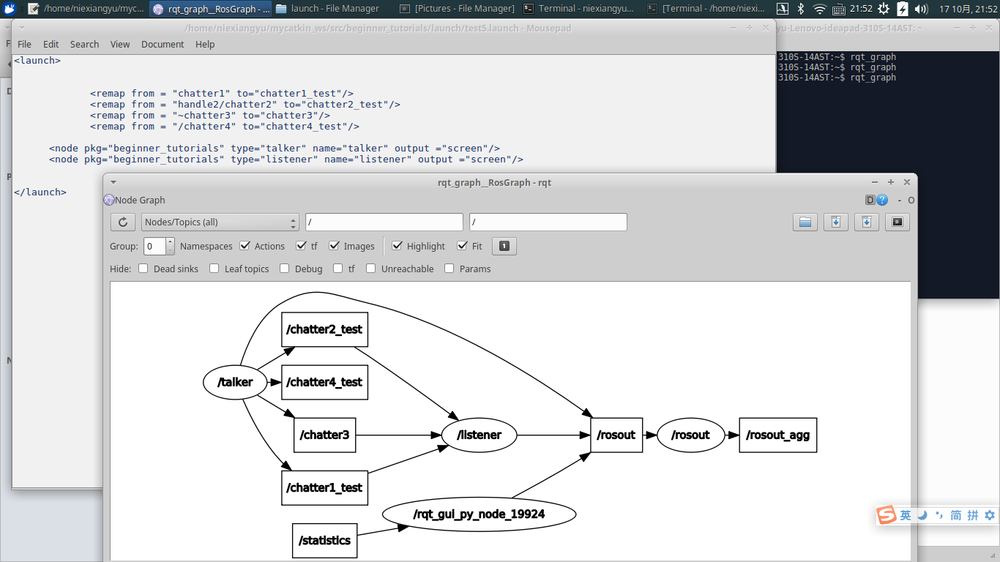
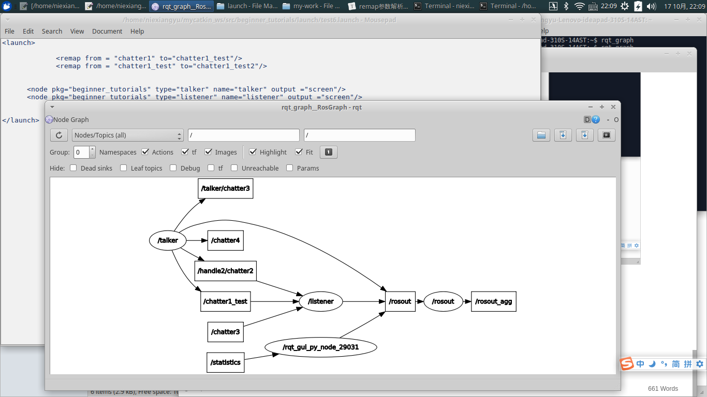
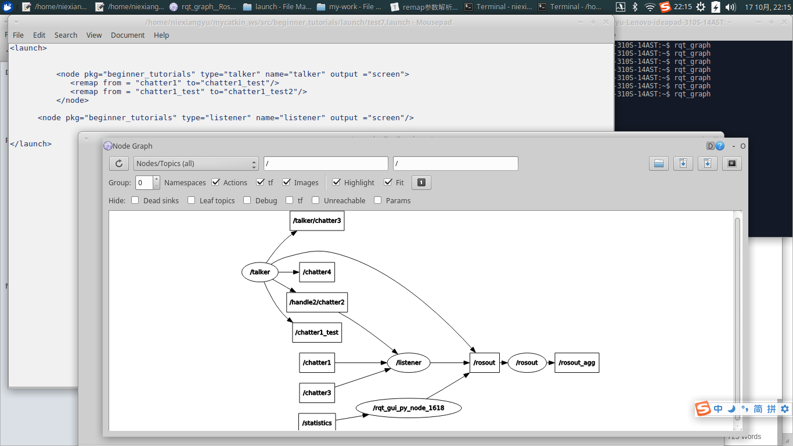
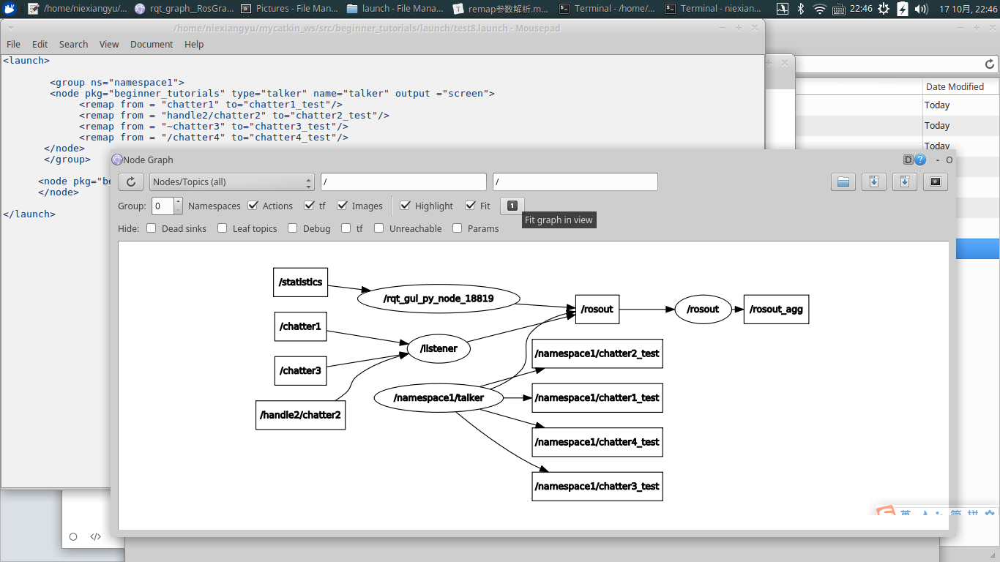
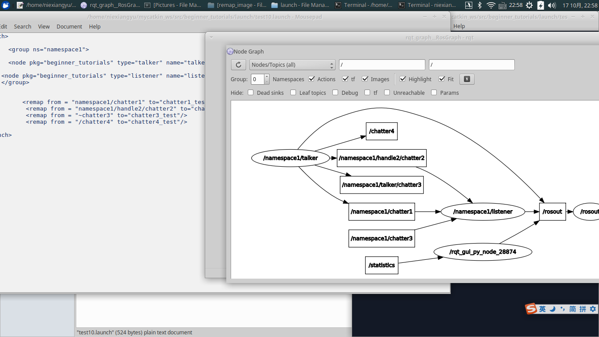

测试参考链接：https://blog.csdn.net/jik198558/article/details/105175352#21_5

博主给了结果，但是没给详细代码，参考此文，自己编码测试。

此文结论：1，当remap和node平行时，from和to可以为launch文件中任意节点。
 2，当remap处于节点内部时，from必须为当前节点所定义的内容，to可以是launch文件中任意节点。

该结果在之前龚磊的文件测试中，对参数进行remap得到证实，已经完善到gitlug上：

http://192.168.1.60/rosvis/launchviz/blob/master/docs/param.md

我的测试除了消息发布器talker之外，增加了消息订阅器listener。

发布器talker:与param_test中一样：

  ros::init(argc, argv, "talker");

  ros::NodeHandle n1;
  ros::NodeHandle n2("handle2");  
  ros::NodeHandle n3("~");

  ros::Publisher chatter_pub1 = n1.advertise<std_msgs::String>("chatter1", 1000);

  ros::Publisher chatter_pub2 = n2.advertise<std_msgs::String>("chatter2", 1000);
  ros::Publisher chatter_pub3 = n3.advertise<std_msgs::String>("chatter3", 1000);

   ros::Publisher chatter_pub4 = n1.advertise<std_msgs::String>("/chatter4", 1000);

订阅器：

 ros::Subscriber sub1 = n1.subscribe("chatter1", 1000, chatterCallback);
  ros::Subscriber sub2 = n1.subscribe("handle2/chatter2", 1000, chatterCallback);
  ros::Subscriber sub3 = n1.subscribe("chatter3", 1000, chatterCallback);

初始测试：运行rosrun beginner_tutorials talker  与 rosrun beginner_tutorials listener ，无launch文件

测试test1.launch:只用remap改变发布器话题

结论：发布器节点内remap过后，topic变化，订阅器（如果不变化）无法接收到原来的topic

测试test2.launch:订阅器接受的chatter1话题remap到发布器remap后的chatter1_test

结论：发布器节点内remap过后，topic变化，订阅器也一样把原来的topic经过remap到发布器remap后的topic，又可以正常接受消息

测试test3.launch: 微调，发布器中~chatter3映射为chatter3与订阅器接受话题对应，成功接受chatter3话题

测试test4.launch:将test3中launch与remap平行（只是把node一行结束，末尾是/>），发现：

发布器中topic没有经过remap变化，listener订阅节点chatter1与handle2/chatter2发生变化，chatter3不变

结论：remap在之后的节点生效，在remap之前的节点不受影响

测试test5.launch:与test4简单地将node与remap平行相比，test5先remap，后定义node

结论：与node平行的remap对之后的2个node，即发布器和订阅器节点都有效，两者共同的节点chatter1、handle2/chatter2映射为chatter1_test、chatter2_test而保持正常通信，
<remap from = "~chatter3" to="chatter3"/>又让订阅器listener接受到发布器talker向~chatter3发送的消息。

测试test6.launch: 连续两次映射节点，A to B,B to C，但是只有第一个生效了，第二个没有生效，与之前结论矛盾

<remap from = "chatter1" to="chatter1_test"/>
<remap from = "chatter1_test" to="chatter1_test2"/>

测试test7.launch:与test6.launch相比，remap放在发布器节点node内部，再次实验重新映射，结果编译通过，但还是只有第一个生效

小结：test6,test7的结论与gitlug上的param.md文件中结论不同，之前测试的是launch文件中定义的param参数名重映射成功，但是这里是cpp文件中发布器与接收器节点的remap，可能因此导致效应不同，具体机理不知道要不要看源代码。

test8.launch测试：在test1基础上,talker加上namespace1，发布器talker的节点加上了namespace1使listener无法正常接收，作为node内部参数，remap的对象在namespace内起作用加上namespace1

test9.launch测试：在test8基础上,在namespace1内让remap与node平行，结果与test8相同。

结论：命名域内，node与remap平行与否与命名域外规则相同。

test10.launch测试：将两个node放在namespace1内部，在namespace外部remap,chatter1与handle2/chatter2之前加上namespace1/，这两个话题恢复talker与listener之间的政策通信，只是前面都加上了namespace1/。

有趣的是不知为何此处chatter4没有受到namespace1的作用，还是/chatter4之前没加namespace1,但是remap还是没有作用。在改成<remap from = "namespace1/chatter4" to="chatter4_test"/>输出图还是一样

测试结果多数符合常规认识：

①remap与node平行时，remap在之后的节点生效，在remap之前的节点不受影响

②命名域内，remap的规则与命名域外规则相同。

新发现：① test6,test7测试发现连续两次映射节点，A to B,B to C，但是只有第一个生效了，第二个没有生效。之前测试的是launch文件中定义的param参数名重映射成功，但是这里是cpp文件中发布器与接收器节点的remap，可能因此导致效应不同，具体机理不知道要不要看源代码。

疑问：①test10测试中，不知为何此处chatter4没有受到namespace1的作用，还是/chatter4之前没加namespace1,但是remap还是没有作用。在改成<remap from = "namespace1/chatter4" to="chatter4_test"/>输出图还是一样